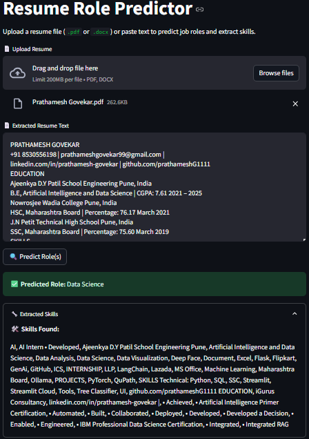

# resume-screening-ai

# 🧠 Resume Screening AI

Automatically classify resumes into job roles like **Data Scientist**, **HR**, **Software Engineer**, etc., using Natural Language Processing and Machine Learning.

---

## 🚀 Demo

Paste your resume into the Streamlit app and get a predicted role instantly.

 <!-- Optional: Replace with your own screenshot -->

---

## 📌 Features
- 🔍 Clean and vectorize raw resume text
- 🧠 Predict job category using trained ML model
- 🌐 Simple UI with Streamlit
- 📈 Achieves up to **87% accuracy**

---

## 🧰 Tech Stack
- **Python 3.10**
- `pandas`, `scikit-learn`, `nltk`
- `TF-IDF` vectorization
- `Logistic Regression` classifier
- `Streamlit` for interactive UI

---

## 📊 Model Performance
| Metric      | Score   |
|-------------|---------|
| Accuracy    | 87%     |
| Precision   | 0.89    |
| Recall      | 0.86    |
| F1-Score    | 0.875   |

> Evaluated on 20% test split using TF-IDF + Logistic Regression.
